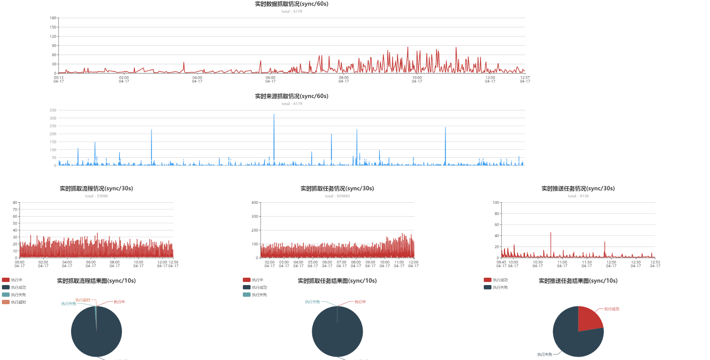
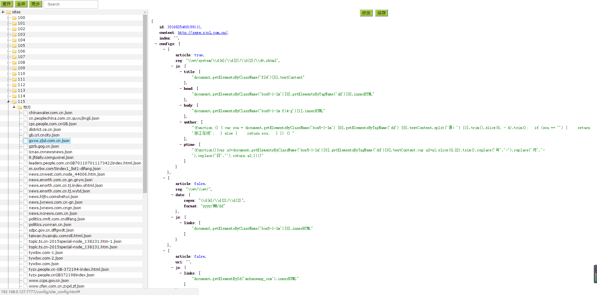

# 爬虫监控系统
综合对爬虫系统的监控，包括  
1：实时抓取量的折线图展示  
2：报表展示指定一天的各源网站抓取的数据量  
3：提供对爬虫站点，流程，任务，任务推送的查询平台  
4：爬虫配置放入zookeeper中，由配置页面进行管理  
5：加入爬虫配置系统，可以及时推送配置到抓取系统  

# 监控图

# 爬虫配置

# 采用框架
使用Gradle创建的Spring Boot项目

# 代码架构技术
1：mapper，service，controller三层，都抽取公共父类，极大的便捷开发，完全使用一套代码。   
2：对外提供dubbo接口。   
3：前后端分离，webapp模块可单独抽出来部署。   
4：前端js抽取共用，分页函数抽离出来。         

# 学习路径
## Spring Boot 是什么
Spring Boot 是 Spring 社区发布的一个开源项目，旨在帮助开发者快速并且更简单的构建项目。大多数 Spring Boot 项目只需要很少的配置文件。
## Spring Boot 特性
* 创建独立的 Spring 项目 
* 内置 Tomcat 和 Jetty 容器 
* 提供一个 starter POMs 来简化 Maven 配置 
* 提供了一系列大型项目中常见的非功能性特性，如安全、指标，健康检测、外部配置等 
* 完全没有代码生成和 xml 配置文件 

## MyBatis 分页插件 - PageHelper
# 支持 MyBatis 3.1.0+ 该插件目前支持以下数据库的物理分页:
* Oracle
* Mysql
* MariaDB
* SQLite
* Hsqldb
* PostgreSQL
* DB2
* SqlServer(2005,2008)
* Informix
* H2
* SqlServer2012
* Derby
MyBatis 分页插件: [http://git.oschina.net/free/Mybatis_PageHelper](http://git.oschina.net/free/Mybatis_PageHelper) 

## ECharts简介
ECharts，缩写来自Enterprise Charts，商业级数据图表，一个纯Javascript的图表库，可以流畅的运行在PC和移动设备上，兼容当前绝大部分浏览器（IE6/7/8/9/10/11，chrome，firefox，Safari等），底层依赖轻量级的Canvas类库ZRender，提供直观，生动，可交互，可高度个性化定制的数据可视化图表。创新的拖拽重计算、数据视图、值域漫游等特性大大增强了用户体验，赋予了用户对数据进行挖掘、整合的能力。

支持折线图（区域图）、柱状图（条状图）、散点图（气泡图）、K线图、饼图（环形图）、雷达图（填充雷达图）、和弦图、力导向布局图、地图、仪表盘、漏斗图、事件河流图等12类图表，同时提供标题，详情气泡、图例、值域、数据区域、时间轴、工具箱等7个可交互组件，支持多图表、组件的联动和混搭展现。

Echarts官网：[http://echarts.baidu.com/index.html](http://echarts.baidu.com/index.html)

Echarts实例：[http://echarts.baidu.com/doc/example.html](http://echarts.baidu.com/doc/example.html)

# 问题反馈
在使用中有任何问题，欢迎反馈给我，可以用以下联系方式跟我交流

* 邮件: (zhou5827297@163.com)
